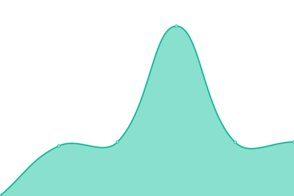

# [📈 Live Status](https://uptimestatus.github.io/upptime): <!--live status--> **🟧 Partial outage**

This repository contains the open-source uptime monitor and status page for [uptimestatus](https://uptimestatus.github.io/upptime), powered by [Upptime](https://github.com/upptime/upptime).

With [Upptime](https://upptime.js.org), you can get your own unlimited and free uptime monitor and status page, powered entirely by a GitHub repository. We use [Issues](https://github.com/uptimestatus/upptime/issues) as incident reports, [Actions](https://github.com/uptimestatus/upptime/actions) as uptime monitors, and [Pages](https://uptimestatus.github.io/upptime) for the status page.

<!--start: status pages-->
<!-- This summary is generated by Upptime (https://github.com/upptime/upptime) -->
<!-- Do not edit this manually, your changes will be overwritten -->
<!-- prettier-ignore -->
| URL | Status | History | Response Time | Uptime |
| --- | ------ | ------- | ------------- | ------ |
|  [Homepage](https://pavela.net) | 🟩 Up | [homepage.yml](https://github.com/uptimestatus/upptime/commits/HEAD/history/homepage.yml) | 

 696ms
     
 | 

<a href="https://status.pavela.net/history/homepage">100.00%</a>
    

|  [Git Server](https://git.pavela.net) | 🟥 Down | [git-server.yml](https://github.com/uptimestatus/upptime/commits/HEAD/history/git-server.yml) | 

 0ms
     
 | 

<a href="https://status.pavela.net/history/git-server">0.00%</a>
    

|  [Search Engine](https://search.pavela.net) | 🟥 Down | [search-engine.yml](https://github.com/uptimestatus/upptime/commits/HEAD/history/search-engine.yml) | 

 0ms
     
 | 

<a href="https://status.pavela.net/history/search-engine">0.00%</a>
    

|  [Nextcloud](https://cloud.pavela.net) | 🟥 Down | [nextcloud.yml](https://github.com/uptimestatus/upptime/commits/HEAD/history/nextcloud.yml) | 

 0ms
     
 | 

<a href="https://status.pavela.net/history/nextcloud">0.00%</a>
    

|  [Jenkins](https://jenkins.pavela.net) | 🟥 Down | [jenkins.yml](https://github.com/uptimestatus/upptime/commits/HEAD/history/jenkins.yml) | 

 0ms
     
 | 

<a href="https://status.pavela.net/history/jenkins">0.00%</a>
    

<!--end: status pages-->

[**Visit our status website →**](https://uptimestatus.github.io/upptime)

## 📄 License

- Powered by: [Upptime](https://github.com/upptime/upptime)
- Code: [MIT](./LICENSE) © [uptimestatus](https://uptimestatus.github.io/upptime)
- Data in the `./history` directory: [Open Database License](https://opendatacommons.org/licenses/odbl/1-0/)
